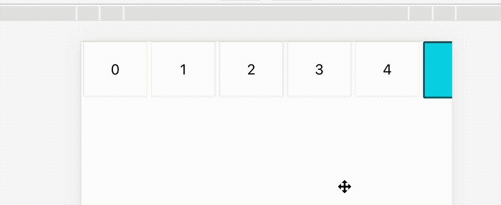
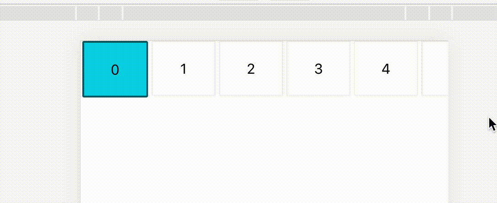

# navbar-scroll

## what is this?

一個可以讓你的 navbar 滾動時,使 active 保持置中

One that allows you to keep active when scrolling navbar.

## Show

### Unused


### Usage


## Getting Started

### install

yarn: `yarn add navbar-scroll`

npm: `npm install navbar-scroll`

### Usage

#### javascript

```javascript
const { navbarScroll } = require("navbar-scroll");

navbarScroll({ activeItem, scrollContainer });
```

#### TypeScript

```typescript
import { navbarScroll } from "navbar-scroll";

navbarScroll({ activeItem, scrollContainer });
```
